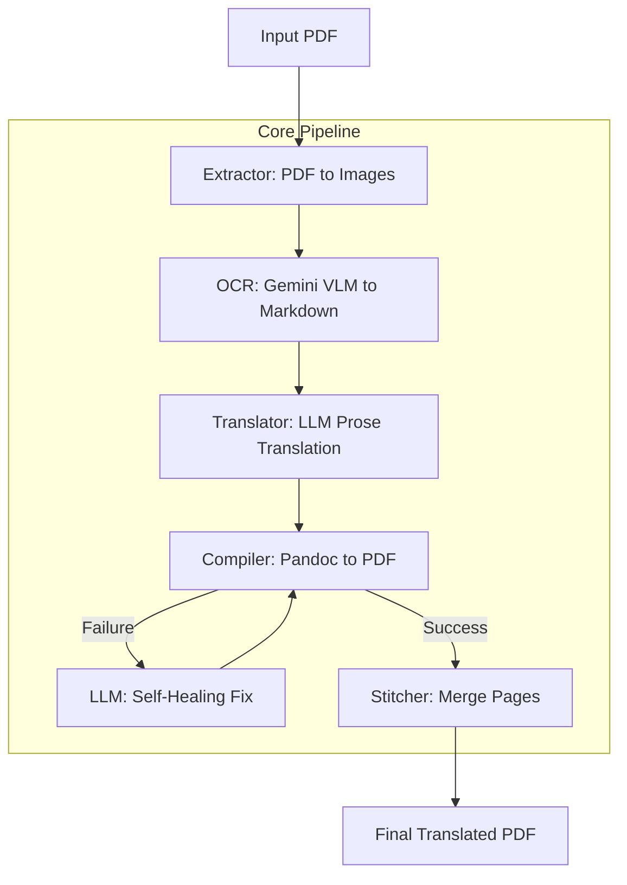

# SciTranslator: Multimodal Scientific Paper Translator 📄🧪

SciTranslator is a robust, modular pipeline designed to translate complex scientific papers while preserving their original layout, formatting, and mathematical equations. By leveraging Vision-Language Models (VLMs) and an LLM-powered "self-healing" compilation loop, it converts PDFs into high-fidelity translated documents.

## 🌟 Key Features

*   **VLM-Powered OCR:** Uses Gemini's vision capabilities to perform layout-aware OCR, converting pages directly into GitHub-flavored Markdown.
*   **LaTeX Preservation:** Intelligently identifies and preserves mathematical formulas using LaTeX syntax (`$...$` and `$$...$$`).
*   **Self-Healing Compilation:** A unique "Retry Loop" that catches Pandoc/LaTeX errors and uses an LLM to automatically fix Markdown syntax issues during PDF generation.
*   **Modular Architecture:** Separate stages for extraction, OCR, translation, and compilation, making the pipeline easy to debug and extend.
*   **Asset Management:** Automatically extracts and re-inserts images and diagrams into the translated document.

## 🏗️ Architecture & Workflow

The pipeline follows a sophisticated "Research -> OCR -> Translate -> Compile" workflow:



## 🛠️ Tech Stack

*   **Core Logic:** Python 3.12+
*   **VLM/LLM:** Google Gemini (via `google-generativeai`)
*   **PDF Processing:** PyMuPDF (`fitz`)
*   **Document Conversion:** Pandoc + Tectonic (LaTeX engine)
*   **Configuration:** YAML

## 🚀 Getting Started

### Prerequisites

Ensure you have the following installed on your system:
- **Pandoc:** [Installation Guide](https://pandoc.org/installing.html)
- **Tectonic:** [Installation Guide](https://tectonic-typesetting.org/en-US/install.html)
- **Python 3.12+**

### Installation

1.  Clone the repository:
    ```bash
    git clone https://github.com/zenor-ode/scitranslator.git
    cd scitranslator
    ```
2.  Install dependencies:
    ```bash
    pip install -r requirements.txt
    ```
3.  Set up your Gemini API Key in a `.env` file:
    ```bash
    GEMINI_API_KEY=your_api_key_here
    ```

### Usage

1.  Place your source PDF in the project directory.
2.  Configure `config.yaml` with your target language and file names.
3.  Run the pipeline:
    ```bash
    python run.py
    ```

## 📝 Configuration

You can customize the pipeline behavior in `config.yaml`:
```yaml
pipeline:
  input_pdf: "sample.pdf"
  output_pdf: "output/translated_paper.pdf"
  target_language: "English"

formatting:
  dpi: 300
  papersize: "a4"
  margin: "2cm"
  fontsize: "11pt"
```

## 🛡️ License

[MIT License](LICENSE)
